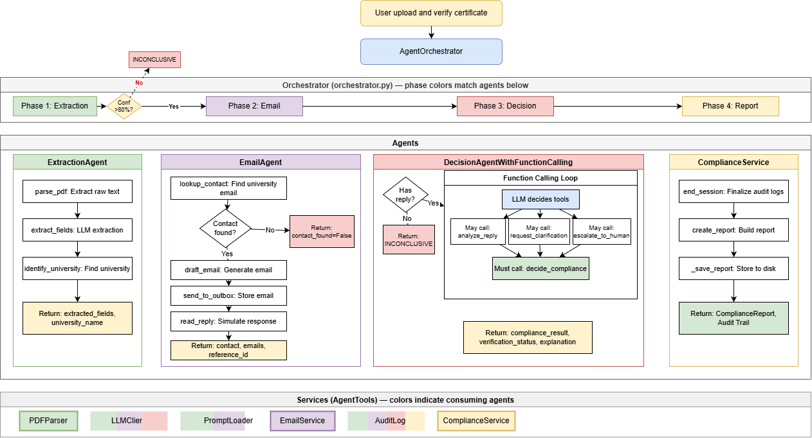

# AgentCheck - AI-Powered Certificate Verification System

<div align="center">

### **[Live Demo](https://agentcheck.onrender.com)** &nbsp;&nbsp;|&nbsp;&nbsp; **[API Documentation](https://agentcheck.onrender.com/docs)**

</div>

---

[](https://www.python.org/downloads/)
[](https://fastapi.tiangolo.com/)
[](https://www.docker.com/)

An AI agent system that automates the qualification verification workflow for RegTech compliance. The system uses a multi-agent architecture to extract certificate information, communicate with universities, and make compliance decisions with full audit trails.

## Architecture



<div style="page-break-before: always;"></div>

## Project Structure

```
AgentCheck/
├── api/                           # Python backend
│   ├── agents/                    # AI Agents
│   │   ├── orchestrator.py        # Main coordinator
│   │   ├── extraction_agent.py
│   │   ├── email_agent.py
│   │   ├── decision_agent.py
│   │   └── decision_agent_fc.py   # Function calling variant
│   ├── tools/                     # Agent tools (modular mixins)
│   │   ├── base.py
│   │   ├── definitions.py
│   │   ├── document_tools.py
│   │   ├── communication_tools.py
│   │   ├── analysis_tools.py
│   │   ├── decision_tools.py
│   │   └── tools.py               # Combined tools class
│   ├── models/
│   │   └── schemas.py             # Pydantic models
│   ├── services/
│   │   ├── pdf_parser.py
│   │   ├── email_service.py
│   │   ├── audit_logger.py
│   │   ├── compliance.py
│   │   └── task_queue.py
│   ├── utils/
│   │   ├── llm_client.py
│   │   └── prompt_loader.py
│   ├── constants.py
│   └── main.py                    # FastAPI app + CLI
├── ui/                            # React frontend
│   ├── src/
│   │   ├── components/
│   │   ├── services/
│   │   ├── types/
│   │   ├── App.tsx
│   │   └── main.tsx
│   ├── public/
│   ├── package.json
│   └── vite.config.ts
├── config/
│   ├── universities.json          # University contact mappings
│   └── prompts/                   # Jinja2 prompt templates
├── data/
│   ├── uploads/                   # Uploaded certificates
│   ├── outbox/                    # Outgoing emails
│   ├── inbox/                     # University replies
│   ├── reports/                   # Compliance reports
│   ├── queue/                     # Task queue
│   └── audit_logs/                # Audit trails
├── docs/
│   └── architecture_diagram.png
├── tests/
├── Dockerfile
├── docker-compose.yml
├── nginx.conf
├── requirements.txt
├── RESEARCH_INSIGHT.md
└── README.md
```

## Quick Start

### Option 1: Docker (Recommended)

> Uses a single container with Nginx (serves React) + Uvicorn (Python API) for simpler prototype deployment.

```bash
# Copy environment file and add your Groq API key
cp .env.example .env
# Edit .env and set GROQ_API_KEY

# Build and start with Docker Compose
docker-compose up -d --build

# Access the app at http://localhost:3000
# API Docs at http://localhost:3000/docs
```

### Option 2: Local Development

```bash
# Create virtual environment
python -m venv venv

# Activate (Windows)
venv\Scripts\activate

# Activate (Linux/Mac)
source venv/bin/activate

# Install dependencies
pip install -r requirements.txt

# Copy and configure environment
cp .env.example .env
# Edit .env and set GROQ_API_KEY

# Run API server
uvicorn api.main:app --host 0.0.0.0 --port 8000 --reload
```

<div style="page-break-before: always;"></div>

### Option 3: React Frontend

```bash
# Navigate to ui directory
cd ui

# Install Node.js dependencies
pnpm install

# Start development server
pnpm run dev

# Access the UI at http://localhost:3000
# Make sure the API server is running on port 8000
```

### Option 4: CLI

```bash
# Verify a certificate
python -m api.main verify ./data/sample_pdfs/certificate_verified.pdf

# With specific scenario
python -m api.main verify ./data/sample_pdfs/certificate_denied.pdf --scenario not_verified

# Output as text
python -m api.main verify ./data/sample_pdfs/certificate_verified.pdf --text

# Save report to file
python -m api.main verify ./data/sample_pdfs/certificate_verified.pdf --output report.json

# List recent reports
python -m api.main list

# Get specific report
python -m api.main report <report-id>
```

### University Contacts

University contact information is configured in `config/universities.json`.

## API Endpoints

| Method | Endpoint             | Description            |
| ------ | -------------------- | ---------------------- |
| `GET`  | `/`                  | Health check           |
| `GET`  | `/health`            | Detailed health status |
| `POST` | `/verify`            | Verify a certificate   |
| `POST` | `/upload`            | Upload a PDF file      |
| `GET`  | `/reports`           | List recent reports    |
| `GET`  | `/reports/{id}`      | Get specific report    |
| `GET`  | `/reports/{id}/text` | Get report as text     |
| `GET`  | `/docs`              | Interactive Swagger UI |

## Testing

```bash
# Run all tests
pytest

# Run with coverage
pytest --cov=src --cov-report=html

# Run specific test file
pytest tests/test_agents.py -v
```

## Workflow Demo

### Scenario 1: Verified Certificate

1. Upload `certificate_verified.pdf`
2. Agent extracts: John Smith, University of Example, BSc Computer Science
3. System finds university contact
4. Drafts verification email
5. Receives "verified" reply
6. AI analyzes: **VERIFIED** (95% confidence)
7. Final decision: **COMPLIANT**

### Scenario 2: Denied Certificate

1. Upload `certificate_denied.pdf`
2. Agent extracts: Jane Doe, Global Tech Institute, MBA
3. System finds university contact
4. Drafts verification email
5. Receives "not verified" reply
6. AI analyzes: **NOT_VERIFIED** (90% confidence)
7. Final decision: **NOT COMPLIANT**

### Scenario 3: Unknown University

1. Upload `certificate_unknown.pdf`
2. Agent extracts: Alex Johnson, Unknown Academy, Diploma
3. **No university contact found**
4. Final decision: **INCONCLUSIVE**

## Sample Output

```
======================================================================
COMPLIANCE VERIFICATION REPORT
======================================================================

Report ID: 550e8400-e29b-41d4-a716-446655440000
Generated: 2024-12-03T10:30:00

----------------------------------------------------------------------
FINAL DECISION
----------------------------------------------------------------------
Compliance Result: COMPLIANT
Verification Status: VERIFIED

Explanation:
COMPLIANT: The certificate has been verified as authentic by the
issuing university. The university confirmed the certificate is
authentic. Confidence score: 95%

----------------------------------------------------------------------
CERTIFICATE INFORMATION
----------------------------------------------------------------------
File: certificate_verified.pdf
Candidate: John Smith
University: University of Example
Degree: Bachelor of Science in Computer Science
Issue Date: 2023-05-15

----------------------------------------------------------------------
AUDIT TRAIL
----------------------------------------------------------------------
✓ [2024-12-03T10:30:00] 001_session_start: Started new verification session
✓ [2024-12-03T10:30:01] 002_parse_pdf: Parsing PDF file
✓ [2024-12-03T10:30:02] 003_extract_fields: Extracting structured fields
✓ [2024-12-03T10:30:03] 004_identify_university: Identifying university
✓ [2024-12-03T10:30:04] 005_lookup_contact: Looking up contact
✓ [2024-12-03T10:30:05] 006_draft_email: Generating verification email
✓ [2024-12-03T10:30:06] 007_send_to_outbox: Email stored in outbox
✓ [2024-12-03T10:30:07] 008_read_reply: Reading university reply
✓ [2024-12-03T10:30:08] 009_analyze_reply: Analyzing reply with LLM
✓ [2024-12-03T10:30:09] 010_decide_compliance: Making compliance decision

======================================================================
END OF REPORT
======================================================================
```
